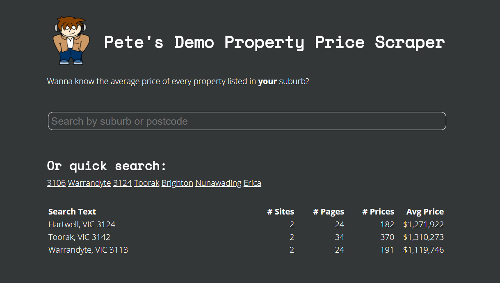

# Demo Golang Property Price Scraper
**Author:** Peter Eldred, June 2018

This project is a quick demo application pulled together by Peter Eldred 06-2018 which scrapes Australian real estate websites for average property prices.

# What does it do?
The application serves a single page on **localhost:8000**. The user is prompted to enter a search term of either a suburb or postcode. Upon submission of the search term, the application uses [Ferret](github.com/argusdusty/Ferret) to look up the most appropriate suburb, state and postcode match for the search criteria.

* The search is submitted to all of the real estate listing sites specified in the config.json file.
* Goroutines are used to scrape each of the listing sites in the shortest possible time
* Multiple searches can be asynchronously executed

# Project Dependancies
Be sure your go installation has these dependencies  before running:
* net/http
* github.com/gorilla/mux
* github.com/PuerkitoBio/goquery
* github.com/argusdusty/Ferret

# How to run
* **Install:** `go get github.com/dJPoida/pse_pp_scraper`
* **Update:** `go get -u github.com/dJPoida/pse_pp_scraper`
* **Run:** `go run main.go` from within the project path

# Notes
* Some suburbs and postcodes will not work properly as the lookup is quite basic at the moment (i.e. searching for "Burwood" will yield a lookup value of "Burwood, NSW 1805" which is not ideal!)

# Credits
* **Postcode Data** courtesy of [Geonames](http://www.geonames.org/)
